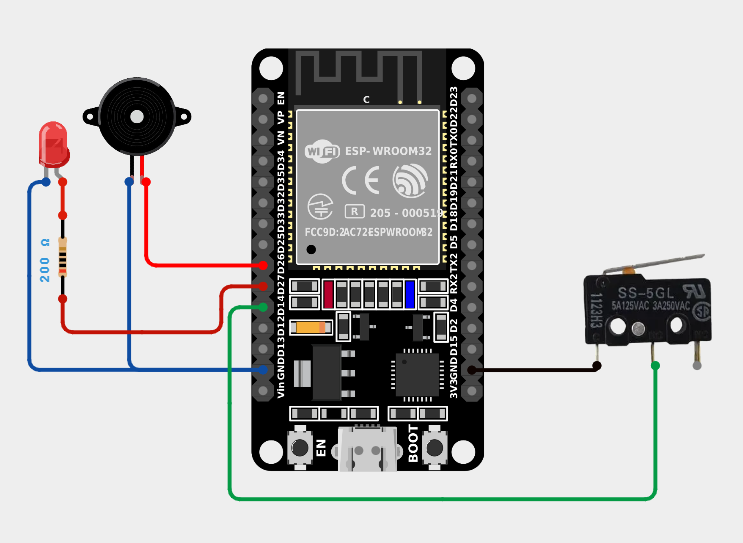

# ESP32-012-Water-Glass-Alarm-with-ESP32🚰
Never forget to drink water on time! This Water Glass Alarm uses an ESP32, micro switch, LED, and buzzer to alert you when your glass is empty or needs attention. A simple yet practical project to encourage healthy hydration habits.
 
---

## 🛠 Components Required

1. [ESP32 Development Board (30-pin)](https://robocraze.com/products/nodemcu-32-wifi-bluetooth-esp32-development-board30-pin?_pos=3&_psq=ESP32&_ss=e&_v=1.0)
2. [Micro Switch](https://robocraze.com/products/2a-125v-ac-microswitch-kw10-z1p-limit-switch?_pos=1&_psq=MICROSWITCH&_ss=e&_v=1.0)
3. [Red LED](https://robocraze.com/products/3mm-red-led-pack-of-10?_pos=2&_sid=29237540e&_ss=r)
4. [Buzzer](https://robocraze.com/products/9-volts-buzzer-small?_pos=1&_psq=BUZZER&_ss=e&_v=1.0)

---

## 🎥 Project Demo

👉 [Watch on Instagram](https://www.instagram.com/reel/DOixdxKEwI0/?igsh=MW1yMzh5cHk1eDNjbg==)

---

## Circuit Diagram
 

---
